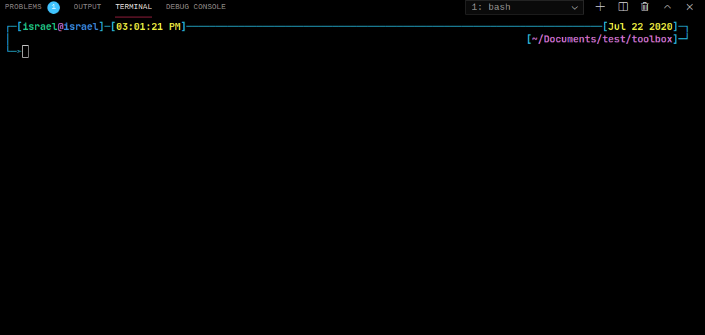

# Parrot Echo | Echo system in JavaScript

[![Forks][forks-shield]][forks-url]
[![Stargazers][stars-shield]][stars-url]
[![Issues-open][issues-open-shield]][issues-url]
[![Issues-closed][issues-closed-shield]][issues-url]
[![Contributors][contributors-shield]][contributors-url]
[![contributions welcome][contributions-welcome]][issues-url]

<div align="center">
  
  <div align="center">
    <h2>Parrot Echo</h2>
    <p>Web Service's Backend and Frontend, powered by Node.js and Docker!</p>
    🖊️🐞
    <a href="https://github.com/Israel-Laguan/parrot-echo/issues">Report a Bug</a>
    🙋‍♂️
    <a href="https://github.com/Israel-Laguan/parrot-echo/issues">Request Feature</a>
  </div>
</div>

An EchoServer is an application that allows a client and a server to connect so a client can send a message to the server and the server can receive the message and send, or echo, it back to the client.

## Server

A server is a computer or computer program that provides a service to another computer, or client. For example, the internet is based on web servers that respond to requests from clients via web browsers. How do you connect to a server to access it services? Often, you will connect to a server over a computer network, which is a group of computers connected together in order to share resources. To connect to a server, you need to know the port number that the server socket is listening on, which is an endpoint for communication between the client and the server. Each port number is associated with an IP address, a numerical label assigned to each device connected to a computer network, and a protocol type, preset rules and guidelines for communicating data. With the port number and IP address, you can attempt to establish a connection to a server. It is important to note that when building an echo server, it is not a requirement to be connected within a network. The server can be run locally on a computer and a client can connect to the server via the same computer.

## Client

A client is responsible for sending a message to the server, and is also where the message is echoed back to. Once the server is running, or listening for connections, a client is able to send a request to the server. With the correct port number and IP address, and if everything goes to plan, the server accepts the connection and creates a new socket. Through the newly created socket, the client and server can now communicate by writing to or reading from the socket.
Dealing with Input and Output

In order to build an echo server that receives a client message and echoes it back to the client, getting the input and output streams from a connected socket is necessary for creating the communication channels between the client and server. These streams are flows of data that mean the client can now send messages to the server, and the server can echo back the message to the client.

## Run It

- Be sure to setup `docker-compose` and have `git`.
- Run this:

```sh
> git clone https://github.com/Israel-Laguan/parrot-echo.git
> cd parrot-echo
> docker-compose build
> npm i && npm run initialize
> docker-compose up
```




Alternativelly you can have both services in different terminals. After building, in one terminal run `docker-compose up server`


And in another one `docker-compose run frontend`


- Enter [localhost:3000][] in a browser for the frontend, and [localhost:8000][] for the backend.

Not a fan of Docker or need more information? Each folder contains instructions about how to setup your PC for run each service locally! Also you can run in root ('parrot-echo/') `npm run start` to start both services! In this case remember to change `proxy` on client!

## DevOps

We developed an infrastructure to deploy this project on AWS. The infrastructure has 3 AWS EC2 instances that are defined below:

- ### Build Server

  Launched an AWS EC2 instance of type **t2.micro** configured with **GitHub Actions Runner**, it is recommended to use an instance of type **m6in.large** based on the characteristics recommended in the [Github documentation](https://docs.github.com/en/actions/using-github-hosted-runners/about-github-hosted-runners#supported-runners-and-hardware-resources). In addition, we have created the **GitHub Actions** YAML files, these are for the different environments (Development, Stage and Production).

  Actions copy the files (in this case the "server" folder) to the server where they will eventually be deployed, using [**appleboy/scp-action**](https://github.com/appleboy/scp-action). The code is then executed using [**appleboy/ssh-action**](https://github.com/appleboy/ssh-action).

    

- ### Backend Business Server

  Launched an AWS EC2 instance of type **t2.micro**, the instance type depends on the number of concurrent connections, project needs, and other factors.

  This has [**NGINX**](https://www.nginx.com/), an HTTP server used to redirect the requests that the server receives to the different subdomains; [**PM2**](https://pm2.keymetrics.io/), a process manager for Node.js and [**Let's Encrypt**](https://letsencrypt.org/es/), a free certificate authority for generating and signing SSL certificates for different domains.

  **Development**
  
  

  **Stage**

  

  **Production**

  

- ### PostgreSQL Server

    Launched an AWS EC2 instance of type **t2.micro**, which deploys a [**PostgreSQL**](https://www.postgresql.org/) database manager, accessible from [**PGAdmin**](https://www.pgadmin.org/) or any client application, through its own subdomain: **db.teamnovasoft.tk**.

    
    

- ### Changes in project files
    The project needs a file **ecosystem.config.js** to work, it has a list (array) of apps, each of them corresponds to a stage (Dev, Stage, Prod). This file will be read by **PM2** and will run the application
    

## Author

<table style="width:100%">
  <tr>
    <td>
        <div align="center">
            <a href="./docs/img/photo.png" target="_blank" rel="author">
                
            </a>
            <h2>
                <a href="https://israel-laguan.github.io/" target="_blank" rel="author">
                    Israel Laguan
                </a>
            </h2>
        </div>
    </td>
    <td>
        <div align="center">
            <a href="mailto:israellaguan@gmail.com" target="_blank" rel="author">
                
            </a>
            <h3>
                <a href="mailto:israellaguan@gmail.com" target="_blank" rel="author">
                    Email me to israellaguan@gmail.com
                </a>
            </h3>
            <a href="https://www.linkedin.com/in/israellaguan/" target="_blank" rel="author">
                
            </a>
            <h3>
                <a href="https://www.linkedin.com/in/israellaguan/" target="_blank" rel="author">
                    Connect to my Linkedin
                </a>
            </h3>
            <a href="https://github.com/Israel-Laguan" target="_blank" rel="author">
                
            </a>
            <h3>
                <a href="https://github.com/Israel-Laguan" target="_blank" rel="author">
                    Check my GitHub Profile
                </a>
            </h3>
        </div>
    </td>
  </tr>
</table>

## Contributing

[![contributions welcome][contributions-welcome]][issues-url]

🤝 Contributions, issues and feature requests are welcome!
Feel free to check the [issues page][issues-url]. Be sure to review the [contributing guidelines](./docs/CONTRIBUTING.md).

Happy programming :smiley: :v:

## Show your support

🤗 Give a ⭐️ if you like this project!

Icons from:

<a href="https://icons8.com/icon/13917/full-image">Icons8</a>

## License

[![License][badge-apache]][apache-license]

📝 This project is licensed under the [Apache 2](LICENSE)\
Feel free to fork this project and improve it

<!-- MARKDOWN LINKS & IMAGES -->

[contributors-shield]: https://img.shields.io/github/contributors/Israel-Laguan/parrot-echo?style=for-the-badge
[contributors-url]: https://github.com/Israel-Laguan/parrot-echo/graphs/contributors
[forks-shield]: https://img.shields.io/github/forks/Israel-Laguan/parrot-echo?style=for-the-badge
[forks-url]: https://github.com/Israel-Laguan/parrot-echo/network/members
[stars-shield]: https://img.shields.io/github/stars/Israel-Laguan/parrot-echo?style=for-the-badge
[stars-url]: https://github.com/Israel-Laguan/parrot-echo/stargazers
[issues-open-shield]: https://img.shields.io/github/issues/Israel-Laguan/parrot-echo?style=for-the-badge
[issues-url]: https://github.com/Israel-Laguan/parrot-echo/issues
[issues-closed-shield]: https://img.shields.io/github/issues-closed/Israel-Laguan/parrot-echo?style=for-the-badge
[badge-framework]: https://img.shields.io/badge/express.js-v4.x-9cf?style=for-the-badge
[framework-url]: https://expressjs.com/
[contributions-welcome]: https://img.shields.io/badge/contributions-welcome-brightgreen.svg?style=for-the-badge
[javascript]: https://img.shields.io/badge/JAVASCRIPT-ES6%2B-F7DF1E?style=for-the-badge&logo=javascript
[nodejs]: https://img.shields.io/badge/node.js-V14.x-339933?style=for-the-badge&logo=node.js
[badge-apache]: https://img.shields.io/badge/License-Apache%202.0-blue.svg?style=for-the-badge
[apache-license]: https://opensource.org/licenses/Apache-2.0
[icons8]: https://icons8.com/
[badge-standard]: https://cdn.rawgit.com/standard/standard/master/badge.svg
[standard-style]: https://github.com/standard/standard
[localhost:8000]: http://localhost:8000
[original-article]: https://medium.com/@himalee.tailor/what-is-an-echoserver-b2bfd3b8deeb
[localhost:3000]: http://localhost:3000
