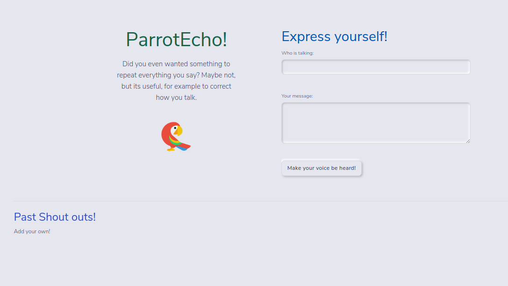
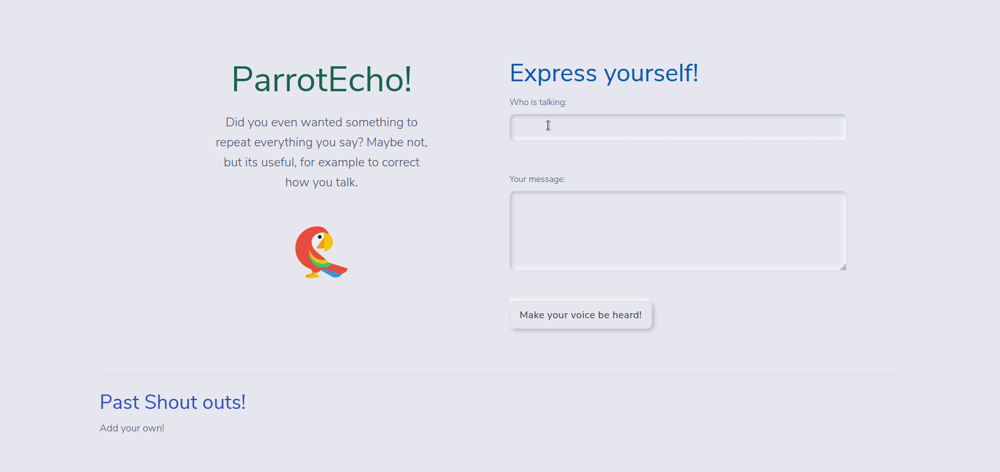
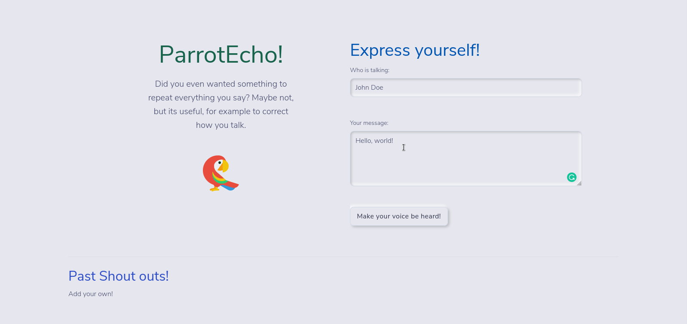
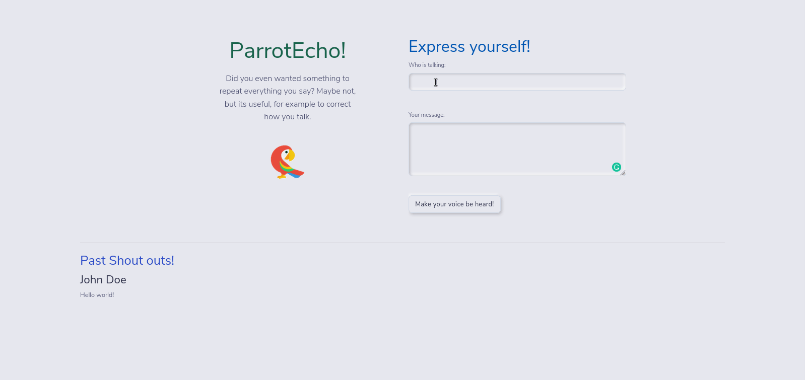
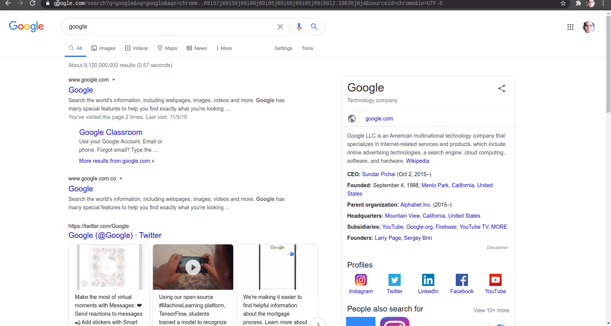

# Parrot Echo Frontend

<!-- PROJECT SHIELDS -->
[![Forks][forks-shield]][forks-url]
[![Stargazers][stars-shield]][stars-url]
[![Issues-open][issues-open-shield]][issues-url]
[![Issues-closed][issues-closed-shield]][issues-url]
[![Contributors][contributors-shield]][contributors-url]
[![contributions welcome][contributions-welcome]][issues-url]

<!-- PROJECT LOGO -->
<br/>
<p align="center">
  <a href="https://github.com/Israel-Laguan/parrot-echo/">
    
  </a>

  <h1 align="center">
	  Parrot Echo!
  </h1>
  <p align="center">
    <br/>
    <a href="https://github.com/Israel-Laguan/parrot-echo/issues">Report a Bug</a>
    🙋‍♂️
    <a href="https://github.com/Israel-Laguan/parrot-echo/issues">Request Feature</a>
  </p>
</p>



## Table of Contents

- [Parrot Echo Frontend](#parrot-echo-frontend)
  - [Table of Contents](#table-of-contents)
  - [The Project](#the-project)
  - [Using the App](#using-the-app)
  - [Features](#features)
  - [Run It](#run-it)
  - [Prerequisites](#prerequisites)
  - [Setup](#setup)
  - [Available Scripts](#available-scripts)
    - [`npm start`](#npm-start)
    - [`npm test`](#npm-test)
  - [Author](#author)
  - [Contributing](#contributing)
  - [Show your support](#show-your-support)
  - [License](#license)

## The Project

Parrot Echo is an app responsible for sending a message to the server, and is also where the message is echoed back to. Once the server is running, or listening for connections, a client is able to send a request to the server.

Parrot Echo have the following features for the first version:

- Upon opening the web application, users should be able to see a form to create messages, also a list of echoes from this session.
- When you submit your message, the response from the server have the same info sent.
- All the past messages are stored and the user can see them in a list.

## Using the App

- Fill the form with your name, and a message to display



- Submit the message to the server



- You'll notice a list is generated below, with past messages



- Bookmark and use the App at your own pace!

## Features

![javascript][]
![react][]
[![Framework][badge-framework]][framework-url]
![css][]

- Using Create React App (CRA)
- Redux
- Bootstrap 4 with custom styles
- Async Fetch
- React-Router
- Mobile Optimized

## Run It

- Be sure to setup `docker-compose` and have `git`.
- Run this:

```sh
> git clone https://github.com/Israel-Laguan/parrot-echo.git
> cd parrot-echo
> docker-compose build
> docker-compose up
```

- Enter [localhost:3000][] in a browser for the frontend.

Not a fan of Docker or need more information? Continue for instructions to learn more about how to setup your PC for run the frontend!

This project was bootstrapped with [Create React App](https://github.com/facebook/create-react-app), using the [Redux](https://redux.js.org/) and [Redux Toolkit](https://redux-toolkit.js.org/) template, so is kinda easy and fast to start it!

## Prerequisites

You will need [Node.js](https://nodejs.org) version 8.0 or greater installed on your system.

## Setup

Get the code by either cloning this repository using git

```bash
git clone git@github.com:Israel-Laguan/parrot-echo.git
cd client
```

... or [downloading source code](git@github.com:Israel-Laguan/parrot-echo.git/archive/master.zip) as a zip archive.

Once downloaded, open the terminal in the project directory, and install dependencies with:

```bash
npm install
```

Then start the app with:

```bash
npm start
```

The app should now be up and running at [localhost:3000][] 🚀



## Available Scripts

In the project directory, you can run:

### `npm start`

Runs the app in the development mode.

Open [localhost:3000][] to view it in the browser.

The page will reload if you make edits.

You will also see any lint errors in the console.

### `npm test`

Launches the test runner in the interactive watch mode.

See the section about [running tests](https://facebook.github.io/create-react-app/docs/running-tests) for more information.


## Author

<table style="width:100%">
  <tr>
    <td>
        <div align="center">
            <a href="./docs/img/photo.png" target="_blank" rel="author">
                
            </a>
            <h2>
                <a href="https://israel-laguan.github.io/" target="_blank" rel="author">
                    Israel Laguan
                </a>
            </h2>
        </div>
    </td>
    <td>
        <div align="center">
            <a href="mailto:israellaguan@gmail.com" target="_blank" rel="author">
                
                <h3>
                    Email me to 
                    <a href="mailto:israellaguan@gmail.com">
                        israellaguan@gmail.com
                    </a>
                </h3>
            </a>
            <a href="https://www.linkedin.com/in/israellaguan/" target="_blank" rel="author">
                
                <h3>
                    Connect to my Linkedin
                </h3>
            </a>
            <a href="https://github.com/Israel-Laguan" target="_blank" rel="author">
                
                <h3>
                    Check my GitHub Profile
                </h3>
            </a>
        </div>
    </td>
  </tr>
</table> 

## Contributing

[![contributions welcome][contributions-welcome]][issues-url]

🤝 Contributions, issues and feature requests are welcome!
Feel free to check the [issues page][issues-url].

## Show your support

🤗 Give a ⭐️ if you like this project!

Icons from:

<a href="https://icons8.com/icon/13917/full-image">Icons8</a>
<a target="_blank" href="https://icons8.com/icons/set/starred-ticket">Movie Ticket icon</a> icon by <a target="_blank" href="https://icons8.com">Icons8</a>
Icons made by <a href="https://www.flaticon.com/authors/catkuro" title="catkuro">catkuro</a> from <a href="https://www.flaticon.com/" title="Flaticon"> www.flaticon.com</a>
Banner by https://www.canva.com

Style: [oliver-gomes](https://github.com/oliver-gomes/react-movie)
StarRating: [Here](https://codesandbox.io/s/v0n20v6143)

## License

[![License][badge-apache]][apache-license]

📝 This project is licensed under the [Apache 2](LICENSE)\
Feel free to fork this project and improve it

<!-- MARKDOWN LINKS & IMAGES -->
[contributors-shield]: https://img.shields.io/github/contributors/Israel-Laguan/parrot-echo?style=for-the-badge
[contributors-url]: https://github.com/Israel-Laguan/parrot-echo/graphs/contributors
[forks-shield]: https://img.shields.io/github/forks/Israel-Laguan/parrot-echo?style=for-the-badge
[forks-url]: https://github.com/Israel-Laguan/parrot-echo/network/members
[stars-shield]: https://img.shields.io/github/stars/Israel-Laguan/parrot-echo?style=for-the-badge
[stars-url]: https://github.com/Israel-Laguan/parrot-echo/stargazers
[issues-open-shield]: https://img.shields.io/github/issues/Israel-Laguan/parrot-echo?style=for-the-badge
[issues-url]: https://github.com/Israel-Laguan/parrot-echo/issues
[issues-closed-shield]: https://img.shields.io/github/issues-closed/Israel-Laguan/parrot-echo?style=for-the-badge
[badge-framework]: https://img.shields.io/badge/store-Redux-000?style=for-the-badge&logo=redux
[framework-url]: https://redux.js.org/
[contributions-welcome]: https://img.shields.io/badge/contributions-welcome-brightgreen.svg?style=for-the-badge
[badge-apache]: https://img.shields.io/badge/License-Apache%202.0-blue.svg?style=for-the-badge
[apache-license]: https://opensource.org/licenses/Apache-2.0
[react]: https://img.shields.io/badge/React-16+-61DAFB?style=for-the-badge&logo=react
[javascript]: https://img.shields.io/badge/JAVASCRIPT-ES6%2B-F7DF1E?style=for-the-badge&logo=javascript
[css]: https://img.shields.io/badge/style-CSS-1572B6?style=for-the-badge&logo=css3
[localhost:3000]: http://localhost:3000
